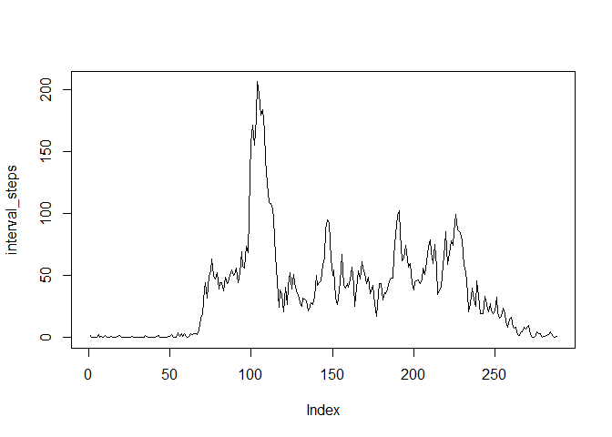
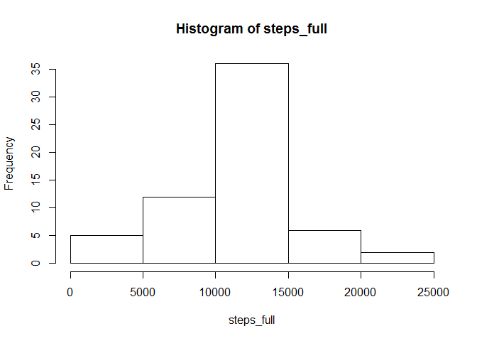
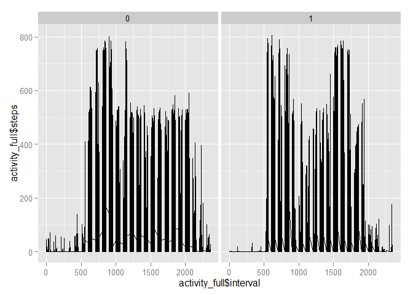

# Reproducible Research: Peer Assessment 1

Load ggplot2 library and set locale to English.

```r
library(ggplot2)
Sys.setlocale("LC_TIME", "C")
```

## Loading and preprocessing the data
Load the data.

```r
# unzip file if it doesn't exist yet
if (!file.exists("activity.csv")) {
    unzip("activity.zip")
}

# read in csv file
activity <- read.csv("activity.csv")
```


## What is mean total number of steps taken per day?
Calculate the total number of steps taken per day ignoring missing values.

```r
# take sum of steps factorized by date
steps <- tapply(activity$steps, activity$date, function(x) sum(x, na.rm = TRUE))
```

Make a histogram of the total number of steps taken each day.

```r
hist(steps, xlab = "Number of steps", title = "Histogram")
```

```
## Warning in plot.window(xlim, ylim, "", ...): "title" is not a graphical
## parameter
```

```
## Warning in title(main = main, sub = sub, xlab = xlab, ylab = ylab, ...):
## "title" is not a graphical parameter
```

```
## Warning in axis(1, ...): "title" is not a graphical parameter
```

```
## Warning in axis(2, ...): "title" is not a graphical parameter
```

 

```r
steps_mean <- round(mean(steps), digits = 2)
steps_median <- median(steps)
```
mean of total number of steps taken per day: 9354.23  
median of total number of steps taken per day: 10395


## What is the average daily activity pattern?
Make a time series plot of the 5-minute interval (x-axis) and the average number of steps taken, averaged across all days (y-axis).

```r
# take mean of steps factorized by interval
interval_steps <- tapply(activity$steps, activity$interval, function(x) mean(x, na.rm = TRUE))
plot(interval_steps, type = "l", xlab = "Interval", ylab = "Number of steps")
```

 

```r
max_interval <- names(which(interval_steps == max(interval_steps)))
```
5-minute interval containing maximum number of steps: 835

## Imputing missing values
Note that there are a number of days/intervals where there are missing values (coded as NA). The presence of missing days may introduce bias into some calculations or summaries of the data.


```r
missing_sum <- sum(is.na(activity))
```
total number of missing values in the dataset: 2304  
  
The strategy for filling in all of the missing values in the dataset is to take the mean of a 5-minute interval and assign it to a missing value in that interval.


```r
# copy dataset
activity_full <- activity

# loop over all rows and fill in missing values of steps with average of the interval
for (i in 1 : nrow(activity_full)) {
    if (is.na(activity_full$steps[i])) {
        activity_full$steps[i] <- interval_steps[as.character(activity_full$interval[i])]
    }
}
```

Make a histogram of the total number of steps taken each day.

```r
steps_full <- tapply(activity_full$steps, activity_full$date, function(x) sum(x, na.rm = TRUE))
hist(steps_full, xlab = "Number of steps", title = "Histogram")
```

```
## Warning in plot.window(xlim, ylim, "", ...): "title" is not a graphical
## parameter
```

```
## Warning in title(main = main, sub = sub, xlab = xlab, ylab = ylab, ...):
## "title" is not a graphical parameter
```

```
## Warning in axis(1, ...): "title" is not a graphical parameter
```

```
## Warning in axis(2, ...): "title" is not a graphical parameter
```

 

```r
steps_full_mean <- round(mean(steps_full), digits = 2)
steps_full_median <- median(steps_full)
```
mean of total number of steps taken per day: 1.076619\times 10^{4}  
median of total number of steps taken per day: 1.0766189\times 10^{4}

Yes, they differ from the steps where missing values were removed because less steps get taken into account. Imputing missing values has the impact of increasing the total daily number of steps.


## Are there differences in activity patterns between weekdays and weekends?

```r
daytype <- vector("integer")
for (i in 1 : nrow(activity_full)) {
    if (is.element(weekdays(as.Date(activity_full$date[i])), c("Saturday", "Sunday"))) {
        daytype[i] <- 1
    } else {
        daytype[i] <- 0
    }
}
activity_full$daytype <- factor(daytype, labels = c("weekday", "weekend"))
qplot(activity_full$interval, activity_full$steps, activity_full, facets = . ~ daytype, geom = "line")
```

 
