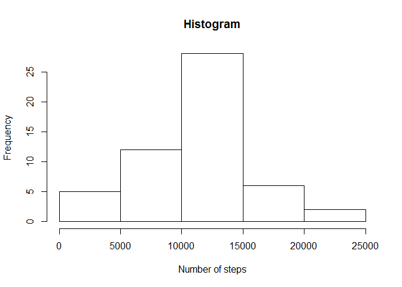

# Reproducible Research: Peer Assessment 1

Set locale to English and load ggplot2 library

```r
library(ggplot2)
Sys.setlocale("LC_TIME", "C")
```

## Loading and preprocessing the data

```r
# unzip file if it doesn't exist yet
if (!file.exists("activity.csv")) {
    unzip("activity.zip")
}

# load the data
activity <- read.csv("activity.csv")
```


## What is mean total number of steps taken per day?

```r
# calculate the total number of steps taken per day ignoring missing values
steps <- tapply(activity$steps, activity$date, function(x) sum(x, na.rm = TRUE))
# make a histogram of the total number of steps taken each day
hist(steps, xlab = "Number of steps")
```

 

```r
steps_mean <- round(mean(steps), digits = 2)
steps_median <- median(steps)
```
mean of total number of steps taken per day: 9354.23  
median of total number of steps taken per day: 10395


## What is the average daily activity pattern?

```r
interval_steps <- tapply(activity$steps, activity$interval, function(x) mean(x, na.rm = TRUE))
plot(interval_steps, type = "l")
```

 

```r
names(which(interval_steps == max(interval_steps)))
```

```
## [1] "835"
```


## Imputing missing values

The strategy is to take the mean of a 5-minute interval and assign it to a missing value in that interval.


```r
sum(is.na(activity))
```

```
## [1] 2304
```

```r
activity_full <- activity
sum(is.na(activity_full))
```

```
## [1] 2304
```

```r
for (i in 1 : nrow(activity_full)) {
    if (is.na(activity_full$steps[i])) {
        activity_full$steps[i] <- interval_steps[as.character(activity_full$interval[i])]
    }
}
sum(is.na(activity_full))
```

```
## [1] 0
```

```r
steps_full <- tapply(activity_full$steps, activity_full$date, function(x) sum(x, na.rm = TRUE))
hist(steps_full)
```

 

```r
mean(steps_full)
```

```
## [1] 10766.19
```

```r
median(steps_full)
```

```
## [1] 10766.19
```

Yes, they differ because less steps get taken into account. With missing values, there will be less steps for each day.


## Are there differences in activity patterns between weekdays and weekends?

```r
daytype <- vector("integer")
for (i in 1 : nrow(activity_full)) {
    if (is.element(weekdays(as.Date(activity_full$date[i])), c("Saturday", "Sunday"))) {
        daytype[i] <- 1
    } else {
        daytype[i] <- 0
    }
}
activity_full$daytype <- factor(daytype, labels = c("weekday", "weekend"))
qplot(activity_full$interval, activity_full$steps, activity_full, facets = . ~ daytype, geom = "line")
```

 
